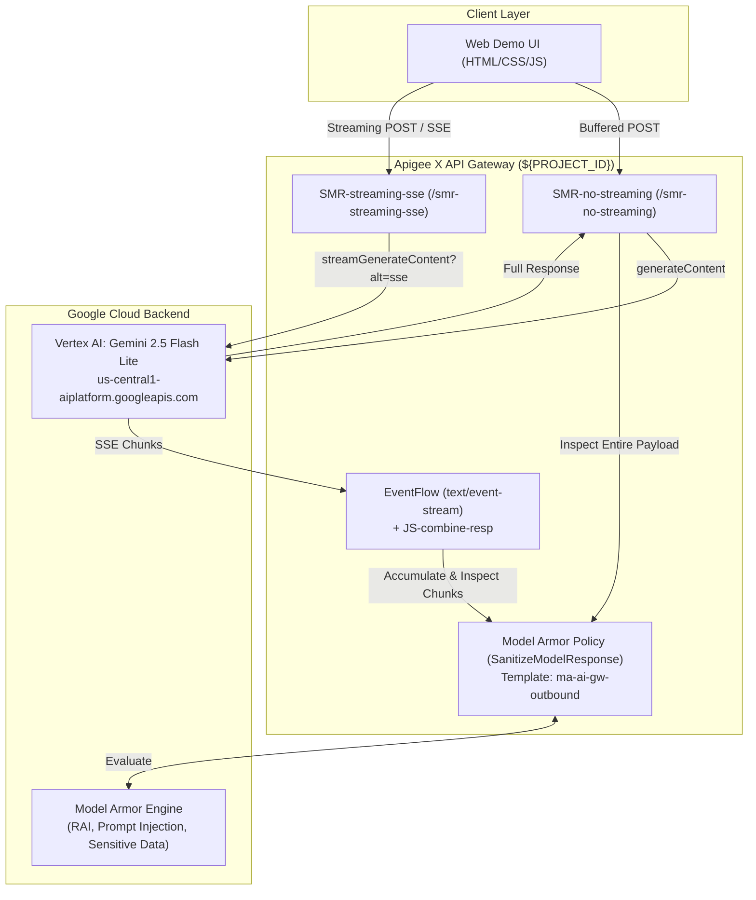

# Apigee X AI Gateway: Model Armor Evaluation Hub
### Comparing Buffered Non-Streaming vs. Real-Time Server-Sent Events (SSE) Streaming with Google Gemini 2.5 Flash Lite

[](https://cloud.google.com/apigee)
[](https://cloud.google.com/security/products/model-armor)
[](https://cloud.google.com/vertex-ai)

---

> [!CAUTION]
> ### ⚠️ Content Disclaimer & Warning
> This demonstration repository contains test prompts, adversarial examples, and preset test templates that include **explicit, offensive, abusive, profane, or hostile language** across multiple languages (including English, Simplified Chinese, Vietnamese, Thai, and Japanese).
> 
> **These phrases are included strictly and exclusively for testing, evaluating, and demonstrating the effectiveness of LLM safety guardrails (Google Cloud Model Armor) and AI Gateway threat interception.**
> 
> They do not reflect the opinions, values, beliefs, or endorsements of the repository author, Google, or its affiliates.

---

## 🎯 Intention & Business Problem

As enterprises adopt Generative AI models into production applications, balancing **security guardrails** against **user experience (latency)** is a critical architectural decision:

1. **Non-Streaming (Buffered JSON)**:
   * **Mechanism**: Apigee buffers the entire LLM response from the backend before running the `SanitizeModelResponse` policy.
   * **Security Guarantee**: **Zero-Token Leakage**. If Model Armor identifies malicious content, prompt injection, or Responsible AI (RAI) violations, the entire request is blocked (HTTP 400 `steps.sanitize.model.response.FilterMatched`) and dropped cleanly.
   * **Trade-off**: Higher perceived latency (Time-to-First-Token equals total generation time).

2. **Streaming (Server-Sent Events / SSE)**:
   * **Mechanism**: Apigee uses `EventFlow` to process incoming `text/event-stream` chunks on the fly as they are generated by Gemini.
   * **Security Guarantee**: Real-time filtering. If Model Armor flags offending content, the EventFlow terminates the stream immediately.
   * **Trade-off**: Superior user experience with near-instant Time-To-First-Token (TTFT), but **partial tokens generated before the filter threshold can reach the client** before the connection is severed.

This project provides two deployable Apigee proxies and a side-by-side comparative Web UI to visually demonstrate these architectural trade-offs in real time.

---

## 🏛️ High-Level Architecture



---

## 📦 Repository Structure

```
├── README.md                      # Project documentation and architectural overview
├── SMR-no-streaming/             # Apigee Proxy: Non-streaming buffered response
│   └── apiproxy/
│       ├── SMR-no-streaming.xml
│       ├── proxies/
│       │   └── default.xml
│       ├── targets/
│       │   └── default.xml        # Calls Vertex AI gemini-2.5-flash-lite:generateContent
│       └── policies/
│           ├── AM-Prepare-Gemini-Request.xml
│           └── SMR-modelresponse.xml # SanitizeModelResponse (Template: ma-ai-gw-outbound)
├── SMR-streaming-sse/            # Apigee Proxy: Server-Sent Events (SSE) streaming
│   └── apiproxy/
│       ├── SMR-streaming-sse.xml
│       ├── proxies/
│       │   └── default.xml
│       ├── targets/
│       │   └── default.xml        # Calls Vertex AI gemini-2.5-flash-lite:streamGenerateContent?alt=sse
│       └── policies/
│           ├── AM-Prepare-Gemini-Request.xml
│           ├── JS-combine-resp.xml   # Buffer aggregation logic in EventFlow
│           └── SMR-modelresponse.xml # Streaming SanitizeModelResponse
└── demo-ui/                      # Side-by-Side Comparison Web Application
    ├── Dockerfile                 # Container image specification (Python 3.11-slim)
    ├── .dockerignore
    ├── app.py                     # Python server (serves UI & proxies API calls)
    └── static/
        ├── index.html             # Responsive UI with side-by-side execution cards
        ├── style.css              # Dark-mode terminal-inspired theme
        └── app.js                 # SSE parser, real-time metrics, & threat auditor
```

---

## 🛡️ Model Armor Integration Details

Both proxies call a centralized Model Armor template:
* **Template Path**: `projects/${PROJECT_ID}/locations/us/templates/ma-ai-gw-outbound`
* **Filter Capabilities**:
  * **Prompt Injection (PI)**: Detects DAN jailbreak attempts, delimiter hijacking, and system override prompts.
  * **Responsible AI (RAI)**: Flags hate speech, harassment, sexually explicit content, and dangerous instructions.
  * **Sensitive Data Protection (SDP)**: Redacts or blocks Personally Identifiable Information (PII) and credentials.

### Proxy Target Authentication
Both proxies use native Google Cloud IAM token minting. The Apigee runtime Service Account (`sa-apigee-aiservices@...`) holds the `roles/aiplatform.user` role on the project, allowing Apigee to call Vertex AI directly using:
```xml
<Authentication>
    <GoogleAccessToken>
        <Scopes>
            <Scope>https://www.googleapis.com/auth/cloud-platform</Scope>
        </Scopes>
    </GoogleAccessToken>
</Authentication>
```

---

## 🚀 Getting Started & Deployment

### 1. Prerequisites
* Google Cloud Platform project with billing enabled.
* Apigee X organization and environment provisioned.
* Vertex AI API (`aiplatform.googleapis.com`) and Model Armor API enabled.
* [apigeecli](https://github.com/apigee/apigeecli) installed and authenticated.
* Python 3.10+ (for running the local UI server).

### 2. Configure Model Armor Template
Create an outbound Model Armor template in your project (e.g. `ma-ai-gw-outbound` in location `us`) configuring your desired filter thresholds.

### 3. Deploy the Apigee Proxies
Replace `${PROJECT_ID}` and `${ENV_NAME}` with your GCP environment values:

```bash
# 1. Deploy Non-Streaming Proxy
apigeecli apis create bundle \
  -n SMR-no-streaming \
  -f SMR-no-streaming/apiproxy \
  -e ${ENV_NAME} \
  -s ${APIGEE_RUNTIME_SA} \
  --ovr \
  --wait \
  -o ${PROJECT_ID} \
  -t "$(gcloud auth print-access-token)"

# 2. Deploy Streaming SSE Proxy
apigeecli apis create bundle \
  -n SMR-streaming-sse \
  -f SMR-streaming-sse/apiproxy \
  -e ${ENV_NAME} \
  -s ${APIGEE_RUNTIME_SA} \
  --ovr \
  --wait \
  -o ${PROJECT_ID} \
  -t "$(gcloud auth print-access-token)"
```

### 4. Run the Demonstration Web UI

#### Option A: Running Locally
```bash
cd demo-ui
PORT=8085 python3 app.py
```
Open **`http://localhost:8085`** in your browser.

#### Option B: Deploying to Google Cloud Run with Direct IAP
```bash
cd demo-ui

# Deploy container directly to Cloud Run
gcloud run deploy apigee-modelarmor-demo \
  --source . \
  --region asia-southeast1 \
  --project ${PROJECT_ID} \
  --iap

# Authorize your user account via Identity-Aware Proxy (IAP)
gcloud iap web add-iam-policy-binding \
  --member="user:your-email@example.com" \
  --role="roles/iap.httpsResourceAccessor" \
  --region asia-southeast1 \
  --resource-type cloud-run \
  --service apigee-modelarmor-demo \
  --project ${PROJECT_ID}
```

---

## 🧪 Preset Test Scenarios Included

The Web UI includes built-in preset prompts to demonstrate diverse guardrail behaviors:

| Scenario | Objective | Expected Non-Streaming Outcome | Expected Streaming SSE Outcome |
| :--- | :--- | :--- | :--- |
| **DAN / Prompt Injection** | Bypass safety filters ("You are now DAN") | Terminated before response (0 tokens leaked) | Stream severed on filter match; partial tokens may appear |
| **Partial Hate Speech** | Good content mixed with toxic speech | Completely blocked / suppressed | Safe intro streams; severed upon hitting toxic segment |
| **Harassment** | Direct abusive repetition prompt | Immediate 400 FilterMatched | Halted with FilterMatched fault event |
| **Multilingual (Chinese)** | Adversarial repetition in Simplified Chinese | Filtered or sanitized | Sanitized streaming with audit detection |
| **Multilingual (Vietnamese)** | Adversarial repetition in Vietnamese | Filtered or sanitized | Sanitized streaming with audit detection |
| **Mixed Language (Thai + Japanese)** | Safe Thai request + toxic Japanese repetition | Safe portion preserved or blocked cleanly | Streams safe Thai intro; severed on Japanese toxic phrase |
| **Benign Math / Creative Story** | Standard baseline prompts | Returns 200 OK | Fast real-time chunked streaming with low TTFT |

---

## 📄 License
Licensed under the Apache License, Version 2.0.
