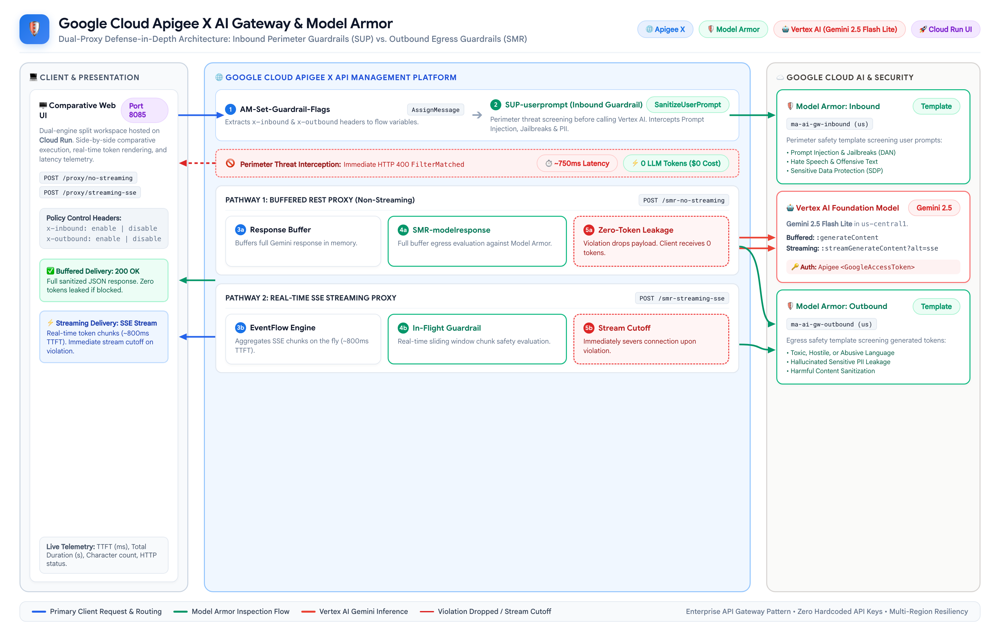
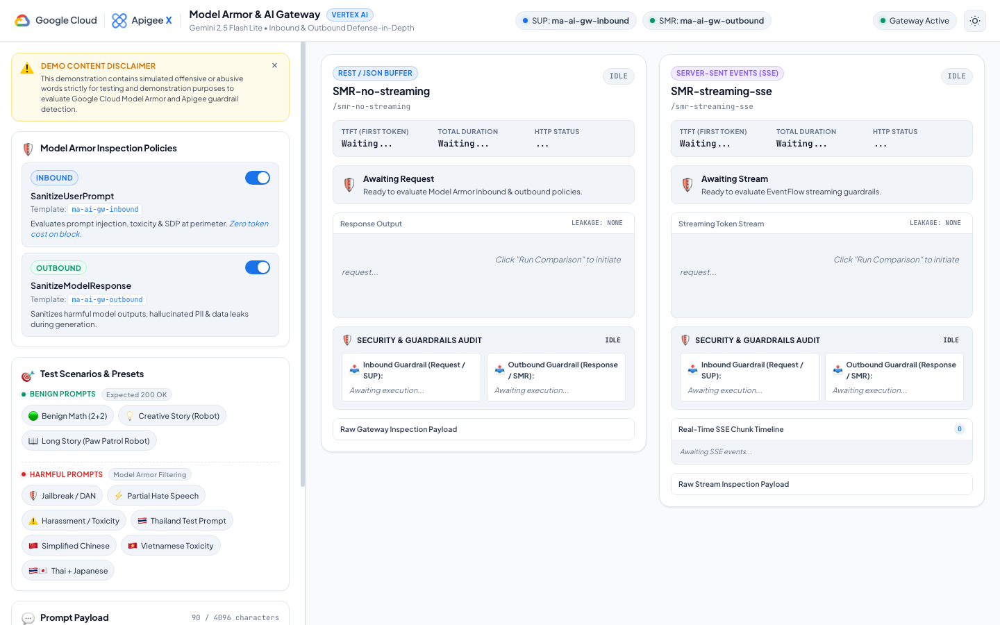
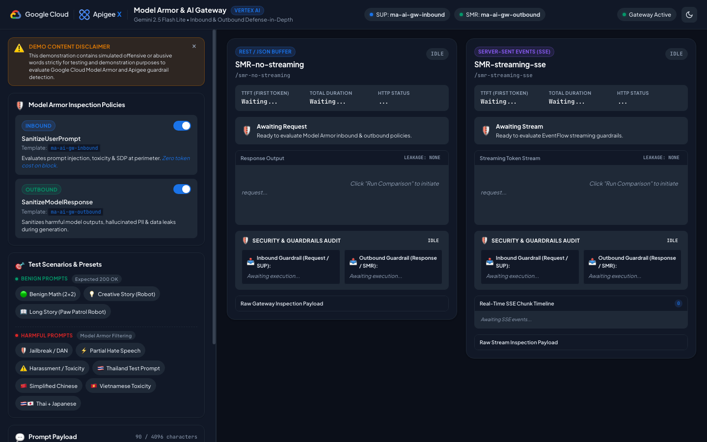

# Apigee X AI Gateway: Model Armor Evaluation Hub
### Inbound & Outbound Defense-in-Depth Security with Google Gemini 2.5 Flash Lite
### Comparing Buffered Non-Streaming vs. Real-Time Server-Sent Events (SSE) Streaming

[](https://cloud.google.com/apigee)
[](https://cloud.google.com/security/products/model-armor)
[](https://cloud.google.com/vertex-ai)
[](https://cloud.google.com/run)

---

> [!CAUTION]
> ### ⚠️ Content Disclaimer & Warning
> This demonstration repository contains test prompts, adversarial examples, and preset test templates that include **explicit, offensive, abusive, profane, or hostile language** across multiple languages (including English, Simplified Chinese, Vietnamese, Thai, and Japanese).
> 
> **These phrases are included strictly and exclusively for testing, evaluating, and demonstrating the effectiveness of LLM safety guardrails (Google Cloud Model Armor) and AI Gateway threat interception.**
> 
> They do not reflect the opinions, values, beliefs, or endorsements of the repository author, Google, or its affiliates.

---

## 🎯 Intention & Business Problem

As enterprises adopt Generative AI models into production applications, balancing **perimeter security**, **LLM egress sanitization**, and **user experience (latency)** is a critical architectural decision:

1. **Perimeter Defense-in-Depth (Inbound vs. Outbound)**:
   * **Inbound Inspection (`SanitizeUserPrompt`)**: Evaluates user prompts at the gateway perimeter before calling Vertex AI. If a prompt injection, jailbreak, or policy violation is detected, the request is blocked immediately (`HTTP 400 steps.sanitize.user.prompt.FilterMatched`) in **~750ms**, generating **zero LLM tokens and zero model inference cost**.
   * **Outbound Inspection (`SanitizeModelResponse`)**: Evaluates model output before delivery to the client. If an inbound check is bypassed or the model hallucinates toxic content or sensitive data, Model Armor intercepts the response at egress.

2. **Latency & Delivery Modes (Buffered JSON vs. SSE Streaming)**:
   * **Non-Streaming (Buffered JSON)**: Apigee buffers the entire LLM response before evaluating outbound policies. Guarantees **Zero-Token Leakage** (the client receives nothing if blocked), but incurs higher Time-to-First-Token (TTFT) latency.
   * **Streaming (Server-Sent Events / SSE)**: Apigee uses `EventFlow` to inspect incoming `text/event-stream` chunks on the fly. Delivers near-instant TTFT (~800ms) and superior UX, but **partial preliminary tokens can reach the client** before the filter threshold triggers a cutoff event.

---

## 🏛️ High-Level Architecture

<p align="center">
  
</p>

---

## 🖥️ Demonstration Web UI

The demo includes a modern, responsive web application designed with the **Google Cloud & Apigee X Minimalist Enterprise Design System** to contrast streaming and non-streaming guardrail behaviors in real time:


<p align="center"><em>Apigee Model Armor Evaluation Hub — Resizable Dual-Engine Comparison Workspace (Light Theme)</em></p>

<details>
<summary>🌙 <strong>Click to expand Dark Theme Preview</strong></summary>
<br/>


<p align="center"><em>Apigee Model Armor Evaluation Hub — Dark Theme View</em></p>

</details>

---

### Section-by-Section Breakdown

#### 1. Top Header & Brand Bar
* **Google Cloud & Apigee X Branding**: Official platform logos and styling aligned with Google Cloud console aesthetics.
* **Active Guardrail Badges**: Indicates active policy templates (`SUP: ma-ai-gw-inbound` and `SMR: ma-ai-gw-outbound`).
* **Gateway Status**: Live ingress health badge (`Gateway Active`).
* **Theme Switcher**: Instant toggle between **Light** and **Dark** modes with user preference automatically persisted in `localStorage`.

#### 2. Resizable Left Control Panel (`#leftPanel`)
* **Horizontal Splitter (`#splitter`)**: Draggable dividing bar allowing users to freely adjust the sidebar width (320px to 750px) according to screen resolution, with state saved across page reloads.
* **Demo Content Disclaimer**: Prominent warning card explaining that simulated offensive or abusive phrases are included strictly for evaluating guardrail accuracy, equipped with a dismiss button (`×`).
* **Model Armor Inspection Policies**:
  * **Inbound (`SanitizeUserPrompt` / `ma-ai-gw-inbound`)**: Intercepts prompt injections, jailbreaks, and sensitive data at the gateway perimeter before calling Vertex AI. Requests blocked here complete in **~750ms with 0 tokens generated and 0 inference cost**.
  * **Outbound (`SanitizeModelResponse` / `ma-ai-gw-outbound`)**: Sanitizes model outputs before delivery to the client, catching hallucinations, toxic outputs, or data leaks.
  * **Interactive Toggles**: Allows live demonstrations of **Inbound Only**, **Outbound Only**, **Both Active (Defense-in-Depth)**, or **Full Bypass**.
* **Categorized Test Scenarios & Presets**:
  * **🟢 Benign Prompts (Top)**:
    * `Benign Math (2+2)`: Baseline 200 OK arithmetic calculation.
    * `Creative Story (Robot)`: Short 2-sentence creative story.
    * `Long Story (Paw Patrol Robot)`: 30+ sentence generation (~1,000 tokens) illustrating the dramatic UX difference between buffered wait (7s) and instant streaming (800ms TTFT).
  * **⚠️ Harmful Prompts (Below)**:
    * `Jailbreak / DAN`: Adversarial system prompt hijack attempt.
    * `Partial Hate Speech`: Benign Paw Patrol introduction followed by hate speech mid-stream.
    * `Harassment / Toxicity`: Direct abusive repetition test.
    * `Thailand Test Prompt`: Native Thai cultural intro + Thai toxicity test.
    * `Simplified Chinese`: Forbidden City intro + Chinese toxicity test.
    * `Vietnamese Toxicity`: Ha Long Bay intro + Vietnamese toxicity test.
    * `Thai + Japanese`: Cross-lingual Thai festival intro + Japanese hate speech.
* **Prompt Payload & Execution Controls**:
  * Textarea with live character counter (up to 4096 characters).
  * `⚡ Run Comparison (Simultaneous)`: Fires both proxies concurrently with identical payload and policy headers.
  * Individual execution triggers (`No-Streaming Only`, `Streaming SSE Only`).
  * Utility buttons (`Clear Outputs`, `🔄 Reset All`).

#### 3. Comparative Result Panes (Right Area)
* **Left Pane: REST / JSON Buffer (`SMR-no-streaming`)**:
  * Apigee buffers the complete response from Vertex AI in memory before running outbound inspection.
  * Demonstrates **Zero-Token Leakage**: If Model Armor triggers a policy violation, Apigee terminates with `HTTP 400 Bad Request` and drops the payload cleanly. The client receives 0 tokens.
* **Right Pane: Server-Sent Events / SSE (`SMR-streaming-sse`)**:
  * Apigee opens an SSE connection immediately, streaming tokens via EventFlow while inspecting chunks in real time.
  * Demonstrates **In-Flight Stream Termination**: If a toxic token is detected mid-stream, Model Armor halts EventFlow and sends an SSE fault event. Shows that benign preliminary chunks reached the client before the stream was severed.
* **Live Metrics Bar**: Side-by-side comparison of **Time-To-First-Token (TTFT)**, **Total Duration**, and **HTTP Status Code**.
* **Security State Banners**: Visual status cards reflecting `IDLE`, `BUFFERING / STREAMING`, `CLEAN PASSED`, or `FILTER BLOCKED`.
* **Token Leakage Indicators**: Clear badges indicating `Leakage: 0 TOKENS (BLOCKED)`, `Leakage: PARTIAL TOKENS STREAMED`, or `Clean / Allowed`.
* **Security & Guardrails Audit Breakdown**: Deep analysis sub-panels for both **Inbound Guardrail (SUP)** and **Outbound Guardrail (SMR)** showing exact matched categories, flagged quotes, and policy notes.
* **Real-Time SSE Chunk Timeline**: Expanding event log that tracks each SSE event chunk and marks the exact chunk where the stream cutoff occurred.
* **Raw Inspection Drawers**: Collapsible JSON inspector showing raw gateway responses and fault details.

---

## 📦 Repository Structure

```
├── README.md                      # Project documentation and architectural guide
├── SMR-no-streaming/             # Apigee Proxy: Non-streaming buffered response
│   └── apiproxy/
│       ├── SMR-no-streaming.xml
│       ├── proxies/
│       │   └── default.xml        # Ingress routing & CORS
│       ├── targets/
│       │   └── default.xml        # Calls Vertex AI generateContent + Conditioned Policies
│       └── policies/
│           ├── AM-Prepare-Gemini-Request.xml
│           ├── AM-Set-Guardrail-Flags.xml    # Maps x-inbound / x-outbound headers
│           ├── SUP-userprompt.xml           # SanitizeUserPrompt (ma-ai-gw-inbound)
│           └── SMR-modelresponse.xml        # SanitizeModelResponse (ma-ai-gw-outbound)
├── SMR-streaming-sse/            # Apigee Proxy: Server-Sent Events (SSE) streaming
│   └── apiproxy/
│       ├── SMR-streaming-sse.xml
│       ├── proxies/
│       │   └── default.xml
│       ├── targets/
│       │   └── default.xml        # Calls Vertex AI streamGenerateContent?alt=sse
│       └── policies/
│           ├── AM-Prepare-Gemini-Request.xml
│           ├── AM-Set-Guardrail-Flags.xml    # Maps x-inbound / x-outbound headers
│           ├── SUP-userprompt.xml           # SanitizeUserPrompt (ma-ai-gw-inbound)
│           ├── JS-combine-resp.xml          # Buffer aggregation logic in EventFlow
│           └── SMR-modelresponse.xml        # Streaming SanitizeModelResponse
└── demo-ui/                      # Modernized Comparative Web Application
    ├── Dockerfile                 # Container image specification (Python 3.11-slim)
    ├── .dockerignore
    ├── app.py                     # Secure Python HTTP proxy (SSE forwarding & headers)
    └── static/
        ├── index.html             # Resizable split workspace with dual result cards
        ├── style.css              # Minimalist Google Cloud & Apigee X design system
        ├── app.js                 # Splitter drag engine, theme switcher & SSE audit engine
        └── assets/
            ├── apigee-logo.svg    # Official Apigee vector logo
            ├── gcp-logo.svg       # Official Google Cloud vector logo
            └── google-cloud.png   # Google Cloud brand mark
```

---

## 🛡️ Model Armor Policies Configuration

Both proxies employ two centralized Model Armor templates in the target flow:

### 1. Inbound: `SanitizeUserPrompt`
* **Policy File**: `SUP-userprompt.xml`
* **Template Path**: `projects/${PROJECT_ID}/locations/us/templates/ma-ai-gw-inbound`
* **Execution Condition**:
  ```xml
  <Step>
      <Condition>flow.enable_inbound != "disable"</Condition>
      <Name>SUP-userprompt</Name>
  </Step>
  ```
* **Enforcement**: Intercepts prompt injection (PI), jailbreak prompts, and user-submitted PII before contacting the model.

### 2. Outbound: `SanitizeModelResponse`
* **Policy File**: `SMR-modelresponse.xml`
* **Template Path**: `projects/${PROJECT_ID}/locations/us/templates/ma-ai-gw-outbound`
* **Execution Condition**:
  ```xml
  <Step>
      <Condition>flow.enable_outbound != "disable"</Condition>
      <Name>SMR-modelresponse</Name>
  </Step>
  ```
* **Enforcement**: Evaluates model-generated content. In non-streaming mode, drops the entire response. In streaming mode, halts the SSE EventFlow upon encountering hate speech, harassment, or sensitive leaks.

---

## 🚀 Getting Started & Deployment

### 1. Required Google Cloud Solutions & Prerequisites

To deploy and demonstrate this architecture, the following Google Cloud services, APIs, and permissions are required:

| Google Cloud Service | Role in Architecture | Required APIs to Enable | Required IAM Roles / Permissions |
| :--- | :--- | :--- | :--- |
| **Google Cloud Apigee X** | Enterprise API Gateway hosting `SMR-no-streaming` and `SMR-streaming-sse`, managing perimeter routing, header flag mapping, OAuth token minting, and streaming `EventFlow`. | `apigee.googleapis.com` | `roles/apigee.admin` (for deployment)<br/>`roles/apigee.runtimeAgent` |
| **Google Cloud Model Armor** | GenAI security guardrails engine executing real-time threat screening via templates: <br/>• `ma-ai-gw-inbound` (Location: `us`) for Prompt Injection, RAI, and Sensitive Data (SDP).<br/>• `ma-ai-gw-outbound` (Location: `us`) for LLM output toxicity and data leakage. | `modelarmor.googleapis.com` | `roles/modelarmor.user` or `roles/modelarmor.admin` (assigned to Apigee Runtime Service Account) |
| **Vertex AI (Gemini 2.5 Flash Lite)** | Backend foundation model for high-speed, cost-effective inference via: <br/>• `generateContent` (Buffered JSON)<br/>• `streamGenerateContent?alt=sse` (Server-Sent Events) | `aiplatform.googleapis.com` | `roles/aiplatform.user` (assigned to Apigee Runtime Service Account) |
| **Cloud IAM & Service Accounts** | Apigee native token minting (`<GoogleAccessToken>`) allowing the runtime to authenticate to Vertex AI and Model Armor without hardcoded keys. | `iam.googleapis.com` | Apigee Runtime SA (`sa-apigee-aiservices@...` or default compute SA) |
| **Google Cloud Run (Optional / UI)** | Serverless container runtime hosting the comparative demonstration Web application (`demo-ui`), proxying SSE chunks, and forwarding policy headers. | `run.googleapis.com` | `roles/run.admin`<br/>`roles/run.invoker` |
| **Artifact Registry & Cloud Build** | Builds the Docker container specification and stores images during Cloud Run source deployment. | `artifactregistry.googleapis.com`<br/>`cloudbuild.googleapis.com` | `roles/artifactregistry.writer`<br/>`roles/cloudbuild.builds.editor` |
| **Developer Workstation Tools** | Local CLI utilities for building, testing, and proxy bundle deployment. | N/A | • `gcloud` CLI (v480.0.0+)<br/>• [`apigeecli`](https://github.com/apigee/apigeecli)<br/>• Python 3.10+ (for local UI testing) |

### 2. Deploy the Apigee Proxies
Replace `${PROJECT_ID}` and `${ENV_NAME}` with your GCP environment values:

```bash
# 1. Deploy Non-Streaming Proxy
apigeecli apis create bundle   -n SMR-no-streaming   -f SMR-no-streaming/apiproxy   -e ${ENV_NAME}   -s ${APIGEE_RUNTIME_SA}   --ovr   --wait   -o ${PROJECT_ID}   -t "$(gcloud auth print-access-token)"

# 2. Deploy Streaming SSE Proxy
apigeecli apis create bundle   -n SMR-streaming-sse   -f SMR-streaming-sse/apiproxy   -e ${ENV_NAME}   -s ${APIGEE_RUNTIME_SA}   --ovr   --wait   -o ${PROJECT_ID}   -t "$(gcloud auth print-access-token)"
```

### 3. Run the Demonstration Web UI

#### Option A: Running Locally
```bash
cd demo-ui
PORT=8085 python3 app.py
```
Open **`http://localhost:8085`** in your browser.

#### Option B: Deploying to Google Cloud Run
```bash
cd demo-ui

# Deploy container directly to Cloud Run
gcloud run deploy apigee-modelarmor-demo   --source .   --region asia-southeast1   --project ${PROJECT_ID}   --allow-unauthenticated
```

---

## 🧪 Preset Test Scenarios Summary

| Scenario | Group | Objective | Inbound ON | Inbound OFF + Outbound ON (Streaming SSE) |
| :--- | :--- | :--- | :--- | :--- |
| **Benign Math (2+2)** | 🟢 Benign | Baseline arithmetic | Passes cleanly (200 OK) | Fast real-time chunked stream (~800ms TTFT) |
| **Creative Story (Robot)** | 🟢 Benign | Short creative story | Passes cleanly (200 OK) | Streams 2 sentences in real time |
| **Long Story (Paw Patrol Robot)** | 🟢 Benign | 30+ sentence generation | Buffered wait (~7s) for full text | Streams ~1,000 tokens immediately |
| **Jailbreak / DAN** | ⚠️ Harmful | System prompt hijack ("You are now DAN") | Blocked at perimeter (**~750ms**, 0 tokens) | Model echoes prompt; severed on response |
| **Partial Hate Speech** | ⚠️ Harmful | Benign Paw Patrol + hate speech mid-stream | Blocked at perimeter (**~750ms**, 0 tokens) | Paw Patrol intro streams; severed on toxic phrase |
| **Harassment / Toxicity** | ⚠️ Harmful | Direct abusive repetition prompt | Blocked at perimeter (**~750ms**, 0 tokens) | Halted with `FilterMatched` fault event |
| **Thailand Test Prompt** | ⚠️ Harmful | Wat Phra Kaew intro + Thai toxicity | Blocked at perimeter (**~950ms**, 0 tokens) | Wat Phra Kaew streams; severed on Thai toxicity |
| **Simplified Chinese** | ⚠️ Harmful | Forbidden City + Chinese toxicity | Blocked at perimeter | Intro streams; severed on Chinese toxicity |
| **Vietnamese Toxicity** | ⚠️ Harmful | Ha Long Bay + Vietnamese toxicity | Blocked at perimeter | Intro streams; severed on Vietnamese toxicity |
| **Thai + Japanese** | ⚠️ Harmful | Thai festival + Japanese hate speech | Blocked at perimeter | Thai intro streams; severed on Japanese hate speech |

---

## 📄 License
Licensed under the Apache License, Version 2.0.
