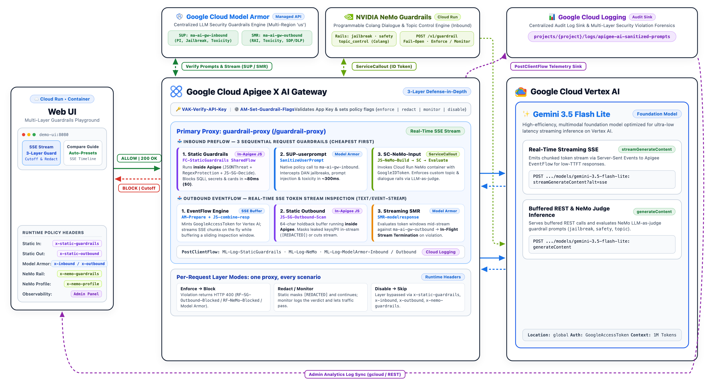
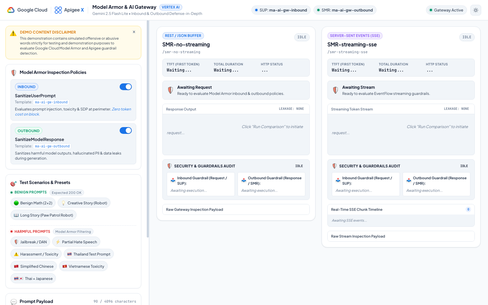

# Apigee X AI Gateway: Layered Guardrails Demo
### Static Guardrails · Google Cloud Model Armor · NVIDIA NeMo Guardrails — in front of Gemini, with real-time SSE streaming

[](https://cloud.google.com/apigee)
[](https://cloud.google.com/security/products/model-armor)
[](https://github.com/NVIDIA/NeMo-Guardrails)
[](https://cloud.google.com/vertex-ai)
[](https://cloud.google.com/run)

---

> [!CAUTION]
> ### ⚠️ Content Disclaimer & Warning
> This demonstration repository contains test prompts, adversarial examples, and preset test templates that include **explicit, offensive, abusive, profane, or hostile language** across multiple languages (including English, Simplified Chinese, Vietnamese, Thai, and Japanese).
>
> **These phrases are included strictly and exclusively for testing, evaluating, and demonstrating the effectiveness of LLM safety guardrails and AI Gateway threat interception.**
>
> They do not reflect the opinions, values, beliefs, or endorsements of the repository author, Google, or its affiliates.

---

## 🎯 Intention & Business Problem

No single guardrail catches everything, and each one has a different cost and latency profile. This demo shows how Apigee X can **layer** guardrails in front of an LLM so that each request is stopped by the cheapest layer that recognises it:

| Layer | Where it runs | Typical latency | Catches |
| :--- | :--- | :--- | :--- |
| **Static Guardrails** | Inside Apigee (SharedFlow, JavaScript) | ~50–80 ms | Known patterns: SQL injection, leaked secrets, classic jailbreak phrases, multilingual abuse word lists. Can also **redact** secrets/PII in responses. |
| **Model Armor** | Google Cloud API (`SanitizeUserPrompt` / `SanitizeModelResponse`) | ~400–800 ms | Meaning-based detection: prompt injection & jailbreak, harmful content (RAI), sensitive data (SDP), malicious URLs — in many languages, with no word lists to maintain. Works **mid-stream** on SSE responses. |
| **NVIDIA NeMo Guardrails** | Cloud Run service called via ServiceCallout | ~0.8–1.2 s | LLM-as-judge rails: topic control (stay on-topic), role-play jailbreaks, content safety. |

Requests that are blocked early generate **zero LLM tokens and zero inference cost**. For streamed responses, Model Armor can cut the stream the moment harmful content appears.

---

## 🏛️ High-Level Architecture

<p align="center">
  
</p>

```
Browser ─► demo-ui (Cloud Run, IAP) ─► Apigee guardrail-proxy ─┬─► StaticGuardrails SharedFlow   (inbound + outbound)
                                                              ├─► Model Armor SUP / SMR         (inbound + mid-stream outbound)
                                                              ├─► nemo-guardrails (Cloud Run)   (inbound, optional profile)
                                                              └─► Vertex AI Gemini  streamGenerateContent?alt=sse
```

Each layer can be switched per request with headers set by the UI (`x-static-guardrails`, `x-static-outbound`, `x-inbound`, `x-outbound`, `x-nemo-guardrails`, `x-nemo-profile`), so the same proxy can demonstrate any combination.

---

## 🖥️ Demonstration Web UI



* **Test Scenario** — tabs for *Baseline*, *Static*, *Model Armor*, *NeMo* and *Layered* scenarios. With **Auto-configure layers** on, picking a scenario also sets the right policies.
* **Prompt** — editable prompt with the expected outcome of the selected scenario.
* **Inspection Policies** — one grid for all three layers (inbound / outbound / NeMo rail), with presets *Strict*, *Safe-flow*, *Observe* and *Off*, plus ⓘ details for each layer.
* **Results** — live SSE token stream, TTFT and total duration, which layer blocked (and why), the Model Armor findings, and a raw SSE chunk timeline.
* **Guided Tour** — 8 short missions (plus a bonus) that walk through each layer. The *What just happened?* panel explains every result, e.g. when Static Guardrails miss a reworded jailbreak and Model Armor catches it.
* **Admin Panel** — audit analytics (block rate, violation types, recent events), synced from Cloud Logging (`apigee-ai-sanitized-prompts`).

---

## 📦 Repository Structure

```
├── guardrail-proxy/              # Apigee API proxy (basepath /guardrail-proxy)
│   ├── apiproxy/
│   │   ├── proxies/default.xml   # VerifyAPIKey, layer flags, FlowCallout to StaticGuardrails, NeMo callout
│   │   ├── targets/default.xml   # Vertex AI streamGenerateContent (SSE), SUP / SMR, outbound scan in EventFlow
│   │   ├── policies/             # SUP-userprompt, SMR-modelresponse, SC-NeMo-Input, JS-SG-Outbound-Scan, ...
│   │   └── resources/jsc/        # nemo-*.js, sg-*.js (outbound redaction)
│   └── tests/                    # scenario_presets_test.py (live end-to-end check of every UI scenario)
├── StaticGuardrails/             # Apigee SharedFlow + environment property set "sg"
│   ├── sharedflowbundle/         # extract/normalise, structure, lexicon, regex rules, verdict
│   ├── src/sg.properties.src     # word lists & rules (UTF-8 source)
│   ├── build.py                  # generates env/sg.properties (\uXXXX-escaped)
│   ├── deploy.sh                 # deploys property set, SharedFlow and guardrail-proxy
│   └── tests/                    # local JS harnesses + live test
├── nemo-guardrails/              # NVIDIA NeMo Guardrails server for Cloud Run
│   ├── configs/                  # jailbreak_self_check, content_safety, topic_control (+ default, pii_masking, agentic_security)
│   ├── entrypoint.py, Dockerfile
│   └── test_guardrails.py
├── demo-ui/                      # Demo web app (Python stdlib server + static front end)
│   ├── app.py                    # SSE proxy to Apigee, admin analytics API, Cloud Logging sync
│   ├── Dockerfile                # non-root python:3.11-slim image
│   └── static/                   # index.html, app.js, style.css, tour/ (Guided Tour)
├── setup-developer-app.sh        # creates the API product + developer app used by VerifyAPIKey
└── run-demo.sh                   # runs the UI locally (fetches the API key from Secret Manager)
```

---

## 🚀 Getting Started & Deployment

### 1. Prerequisites

| Google Cloud Service | Role | APIs | IAM |
| :--- | :--- | :--- | :--- |
| **Apigee X** | Hosts `guardrail-proxy` and the `StaticGuardrails` SharedFlow | `apigee.googleapis.com` | `roles/apigee.admin` (deploy) |
| **Model Armor** | Templates `ma-ai-gw-inbound` and `ma-ai-gw-outbound` (location `us`) | `modelarmor.googleapis.com` | `roles/modelarmor.user` on the Apigee runtime SA |
| **Vertex AI** | Gemini 3.5 Flash Lite via `streamGenerateContent?alt=sse` | `aiplatform.googleapis.com` | `roles/aiplatform.user` on the Apigee runtime SA |
| **Cloud Run** | Hosts `nemo-guardrails` and `demo-ui` | `run.googleapis.com` | `roles/run.admin` (deploy) |
| **Secret Manager** | Stores the Apigee consumer key for `demo-ui` | `secretmanager.googleapis.com` | `roles/secretmanager.secretAccessor` on the UI service account |
| **Cloud Logging** | Audit trail shown in the Admin Panel | `logging.googleapis.com` | `roles/logging.viewer` on the UI service account |
| **IAP** (recommended) | Restricts the UI to your organisation | `iap.googleapis.com` | `roles/iap.httpsResourceAccessor` |

Local tools: `gcloud`, [`apigeecli`](https://github.com/apigee/apigeecli), Python 3.10+, Node.js (for the Static Guardrails harnesses).

### 2. Deploy NeMo Guardrails

```bash
gcloud run deploy nemo-guardrails --source nemo-guardrails --region ${REGION} --project ${PROJECT_ID}
```
Then set its URL in `guardrail-proxy/apiproxy/policies/SC-NeMo-Input.xml`.

### 3. Deploy Static Guardrails and the proxy

```bash
./StaticGuardrails/deploy.sh ${PROJECT_ID} ${ENV_NAME}     # property set + SharedFlow + guardrail-proxy
./setup-developer-app.sh ${PROJECT_ID} ${ENV_NAME} ${DEVELOPER_EMAIL}
```

### 4. Store the API key and run the UI

```bash
# Store the developer app's consumer key in Secret Manager
printf %s "${CONSUMER_KEY}" | gcloud secrets create apigee-modelarmor-demo-api-key --data-file=- --project ${PROJECT_ID}

# Option A: run locally (reads the key from Secret Manager, or from $APIGEE_API_KEY)
./run-demo.sh                       # http://localhost:8085

# Option B: Cloud Run behind IAP
gcloud run deploy apigee-modelarmor-demo --source demo-ui --region ${REGION} --project ${PROJECT_ID} \
  --service-account ${UI_SERVICE_ACCOUNT} \
  --set-secrets APIGEE_API_KEY=apigee-modelarmor-demo-api-key:latest \
  --set-env-vars GCP_PROJECT_ID=${PROJECT_ID},STREAMING_SSE_URL=https://${APIGEE_HOST}/guardrail-proxy \
  --timeout 300 --no-allow-unauthenticated --iap
```

### 5. Verify

```bash
APIGEE_API_KEY=... python3 guardrail-proxy/tests/scenario_presets_test.py   # all UI scenarios, live
```

---

## 🧪 Preset Test Scenarios

| Group | Scenario | Expected result |
| :--- | :--- | :--- |
| Baseline | Benign Math (2+2) · False-Positive Check (SQLi explainer) · Long Story | 200 OK, streamed |
| Static | SQL Injection · Leaked Secret (AWS key) · Thai Abuse | Blocked by Static Guardrails (~60 ms) |
| Static | Outbound Redaction (secret + PII) | 200 OK with `[REDACTED:…]` in the stream |
| Model Armor | Jailbreak / DAN (evades regex) · 中文 Toxicity · Tiếng Việt Toxicity · Sensitive Data (card + SSN) | Blocked by Model Armor on the prompt (400) |
| Model Armor | Partial Hate Speech (mid-stream) | Stream starts, then is cut by Model Armor |
| NeMo | Off-Topic (crypto advice) · Roleplay Jailbreak (FreeGPT) · Harmful Intent | Blocked by NeMo rails |
| Layered | Classic DAN → Static · Roleplay → Model Armor · Crypto Advice → NeMo | All layers on; the first layer that recognises the threat blocks it |

---

## 📄 License
Licensed under the Apache License, Version 2.0.
